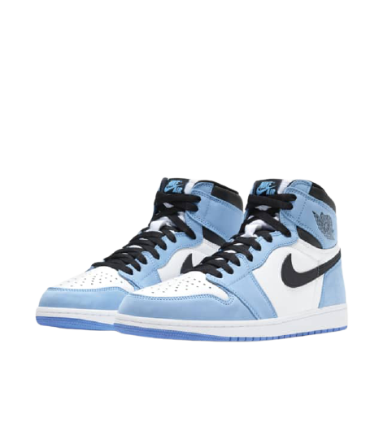

<!-- PROJECT LOGO -->

<br />
<p align="center">
  <a href="https://github.com/samatarx/Sneaker-Launch">
    
  </a>


  <h3 align="center">Sneaker Drop</h3>

  <p align="center">
    A sneaker drop website made with React.js and Bootsrap 4
    <br />
    <br />
    <a href="https://top100cryptocurrencies.netlify.app/" target='#'>View Demo</a>
    ·
    <a href="https://github.com/samatarx/Sneaker-Launch/issues">Report Bug</a>
    ·
    <a href="https://github.com/samatarx/Sneaker-Launch/issues">Request Feature</a>
  </p>
</p>

<!-- TABLE OF CONTENTS -->
<details open="open">
  <summary><h2 style="display: inline-block">Table of Contents</h2></summary>
  <ol>
    <li>
      <a href="#about-the-project">About The Project</a>
      <ul>
        <li><a href="#built-with">Built With</a></li>
      </ul>
    </li>
    <li>
      <a href="#getting-started">Getting Started</a>
      <ul>
        <li><a href="#prerequisites">Prerequisites</a></li>
        <li><a href="#installation">Installation</a></li>
      </ul>
    </li>
    <li><a href="#features">Features</a></li>
    <li><a href="#react">React</a></li>
    <li><a href="#aws">AWS</a></li>
    <li><a href="#seo">SEO</a></li>
    <li><a href="#future_work">Future Work</a></li>
    <li><a href="#contact">Contact</a></li>
    <li><a href="#acknowledgements">Acknowledgements</a></li>
  </ol>
</details>

<!-- ABOUT THE PROJECT -->

## About The Project

I created a sneaker launch website to demonstrate my ability to use React, React-Router and Bootstrap. I have previously used react router in tutorials and I wanted to try it myself and put my own spin on it.

Additionally, I created a form with validation to cement my knowledge of React and I used an external library to assist me with it. Whilst, aslo using AWS to deploy and host the site.

The website is responsive to all screen sizes and has 90+ score on all metrics of the Google Chrome Lighthouse test.

### Built With

- [React JS](https://reactjs.org/)
- [React-Bootstrap](https://react-bootstrap.github.io/)
- [React Router](https://reactrouter.com/)
- [React Hook Form](https://react-hook-form.com/)
- [AWS Amplify](https://aws.com)
- HTML/CSS/JS

<!-- GETTING STARTED -->

## Getting Started

To get a local copy up and running follow these simple steps.

### Prerequisites

This is an example of how to list things you need to use the software and how to install them.

- npm
  ```sh
  npm install npm@latest -g
  ```

### Installation

1. Clone the repo
   ```sh
   git clone https://github.com/samatarx/Sneaker-Launch.git
   ```
2. Install NPM packages
   ```sh
   npm install
   ```

<!-- USAGE EXAMPLES -->

## Features

- Landing and Heritage page which implements Bootstrap 4 for styling
- Preorder form with validation
- Web app is responsive to all screen sizes

<!-- ROADMAP -->

## React

- Implemented the use of React hooks through the project
- Utilised useEffect to create the countdown timer in the footer
- Applied .map() to create all the image components
- Leverage external libraries to create the form
- Used React Router to switch between pages
- 

<!-- Future Improvements -->

## AWS

Deployed my site online rapidly using AWS Amplify for the first time

## SEO

Was able to obtain a high score for the 

## Future_work

- Add more shoes to the store and create a cart with Redux
- Implement AWS Lambdas to create an entirely serverless site

<!-- CONTACT -->

## Contact

Samatar Xasan - [@samatarcodes](https://twitter.com/samatarcodes)

Project Link: [https://github.com/Samatarx/Sneaker-Launch](https://github.com/Samatarx/Sneaker-Launch)

<!-- ACKNOWLEDGEMENTS -->

## Acknowledgements

- [Nike](https://www.nike.com/)
- [Bootstrap](https://getbootstrap.com/)
- [React-Bootstrap](https://react-bootstrap.github.io/)
- [React Router](https://reactrouter.com/)
- [React Hook Form](https://react-hook-form.com/)
